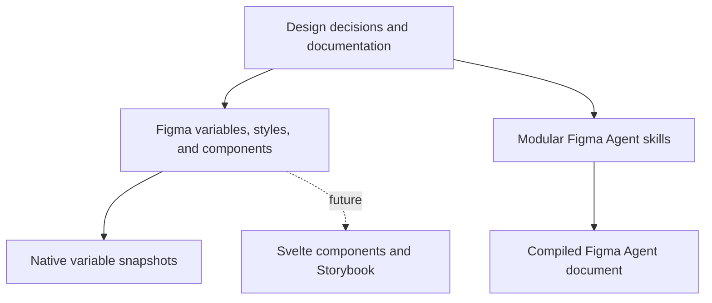

# Stylos Design System

## Master project document

Stylos is a design system for web applications, with a particular focus on dense, desktop-oriented product interfaces. It is currently a private, owner-led Alpha project intended for personal use and possible future commercialization through sale or licensing.

The system combines a strict, architectural visual character with a token-based and component-based implementation model. Its visual language draws on antiquity, classical architecture, columns, proportion, Fibonacci-derived values, and the golden ratio. These references define the system's character and proportional logic; they are not a license to add decorative classical motifs to every interface.

This document is the master description of the project. It records the project's purpose, boundaries, design principles, foundations, component architecture, naming rules, Figma workflows, automation skills, documentation strategy, repository structure, quality model, governance, roadmap, and unresolved decisions.

## Contents

- [1. Document status and terminology](#1-document-status-and-terminology)
- [2. Project passport](#2-project-passport)
- [3. Purpose](#3-purpose)
- [4. Scope and non-goals](#4-scope-and-non-goals)
- [5. Design character](#5-design-character)
- [6. Core design principles](#6-core-design-principles)
- [7. System architecture](#7-system-architecture)
- [8. Source-of-truth model](#8-source-of-truth-model)
- [9. Token architecture](#9-token-architecture)
- [10. Color system](#10-color-system)
- [11. Typography system](#11-typography-system)
- [12. Spacing and sizing](#12-spacing-and-sizing)
- [13. Icons, borders, radii, and effects](#13-icons-borders-radii-and-effects)
- [14. Component architecture](#14-component-architecture)
- [15. Naming and public API rules](#15-naming-and-public-api-rules)
- [16. Known naming conflict](#16-known-naming-conflict)
- [17. Component documentation standard](#17-component-documentation-standard)
- [18. Figma Agent skill system](#18-figma-agent-skill-system)
- [19. Skill source and distribution architecture](#19-skill-source-and-distribution-architecture)
- [20. Proposed repository structure](#20-proposed-repository-structure)
- [21. Documentation architecture](#21-documentation-architecture)
- [22. Quality model](#22-quality-model)
- [23. Governance](#23-governance)
- [24. Versioning and releases](#24-versioning-and-releases)
- [25. Current milestone](#25-current-milestone)
- [26. Roadmap](#26-roadmap)
- [27. Open decisions](#27-open-decisions)
- [28. Known risks](#28-known-risks)
- [29. Success criteria](#29-success-criteria)
- [30. Historical evidence](#30-historical-evidence)
- [31. Source inventory](#31-source-inventory-as-of-20-august-2026)
- [32. Glossary](#32-glossary)

## 1. Document status and terminology

The project contains decisions at different levels of maturity. This document uses the following labels conceptually:

- **Confirmed** — an explicit current rule or project decision.
- **Current** — implemented or represented in current Stylos artifacts.
- **Historical** — demonstrated in an earlier working implementation of Stylos, but not necessarily formalized in the current Alpha package.
- **Planned** — accepted direction that has not yet been implemented.
- **Open** — not yet decided or containing a known conflict.

When a current skill contains a more specific rule than a general project convention, the specific skill governs its own operation. When two current artifacts conflict, the conflict must be resolved explicitly rather than silently choosing whichever rule is easier to apply.

## 2. Project passport

| Field | Current value |
| --- | --- |
| Name | Stylos Design System |
| Status | Alpha; internal development |
| Owner and decision maker | Artur Trifonov |
| Initial creation date | Not formally recorded |
| Master document created | 20 August 2026 |
| Contact | To be defined |
| Primary design tool | Figma |
| Current implementation scope | Design foundations, Figma components, documentation, Figma Agent skills, repository template |
| Planned implementation technology | Svelte |
| Planned documentation surface | Storybook or another web documentation surface |
| Supported product platform | Web |
| Primary interface class | Desktop-oriented web applications |
| Mobile support | Out of current scope |
| Current ownership model | Solo owner; individual approval of changes |
| Release cadence | Irregular during Alpha |
| Intended use | Personal projects first; possible future sale or licensing |
| Figma link | To be added |
| Repository link | To be added |
| Storybook link | To be added |
| License | To be decided before external distribution |

## 3. Purpose

Stylos exists to provide a reusable but recognizably authored system for complex web products. It should make interface design faster and more consistent without becoming a visually neutral collection of generic controls.

The system is intended to:

- provide a coherent set of foundations and reusable interface components;
- support dense application interfaces rather than only marketing pages;
- encode visual and behavioral decisions in variables, styles, components, and public component properties;
- make light, dark, and eventually client-specific themes possible without rebuilding components;
- preserve a distinct classical and structural character across products;
- reduce manual design decisions and uncontrolled local overrides;
- support consistent reconstruction of external references through semantic mapping;
- form the design source for a later Svelte implementation and Storybook documentation;
- remain maintainable by a single owner during the Alpha stage;
- become packageable and explainable enough for future commercial distribution.

## 4. Scope and non-goals

### 4.1 Current scope

The current project covers:

- Figma Variables and styles;
- design-token architecture;
- color, typography, spacing, sizing, icon, radius, border, and effect foundations as they are defined;
- Figma components and component sets;
- component API conventions;
- component documentation;
- naming and structural rules;
- Figma Agent skills for repeatable operations and audits;
- native Figma variable exports as versioned snapshots;
- a repository structure for documentation, exports, skills, and build tools;
- release, quality, and governance rules suitable for an Alpha system.

### 4.2 Planned scope

The planned project scope includes:

- a Svelte component package;
- Storybook or equivalent web documentation;
- design-to-code mapping between Figma assets and Svelte components;
- automated validation and linting where Figma APIs allow reliable checks;
- a reproducible build that compiles modular skill sources into an importable Figma Agent document;
- commercial packaging, licensing, and support rules if the system is released externally.

### 4.3 Explicit non-goals for the current stage

Stylos is not currently intended to:

- support native mobile applications;
- support native desktop UI toolkits;
- provide a finished frontend implementation;
- reproduce screenshots pixel-for-pixel;
- import another product's visual language into Stylos;
- depend on a paid Tokens Studio plan;
- make Figma and code bidirectionally editable before a reliable workflow exists;
- automate destructive component repairs without review;
- treat every raw value as an error when a documented implementation exception applies;
- become an unopinionated white-label kit with no visual identity.

## 5. Design character

### 5.1 Conceptual basis

The name and character of Stylos are associated with the column, antiquity, architecture, and constructed proportion. The intended qualities are:

- classical rather than fashionable;
- strict rather than casual;
- structural rather than decorative;
- measured rather than arbitrary;
- distinctive without preventing product customization;
- suitable for complex, tool-like products.

### 5.2 Proportional logic

Fibonacci numbers and derivatives are intended to influence token scales, spacing, sizing, and relationships. The golden ratio is a source of proportional logic. These principles should produce repeatable relationships, not force every individual measurement into a mathematical sequence when usability or implementation makes that inappropriate.

The exact spacing and size scales are not yet fully formalized. Until they are, “Fibonacci-based” is a design direction, not permission to invent new values case by case.

### 5.3 Customization boundary

Stylos should support themes and product-specific content while retaining its own component anatomy, scale, typography logic, interaction patterns, and proportional character. Customization should happen primarily through documented semantic variables and supported component properties, not by overriding component internals.

## 6. Core design principles

### 6.1 Transfer roles, not raw parameters

When adapting an external reference, interpret what each element does before considering how it looks. Map “primary action,” “selected item,” “muted helper text,” or “warning status” to Stylos roles. Do not copy source colors, typography, radii, shadows, icon style, or control dimensions.

### 6.2 Stylos is the visual source of truth

References may define content, hierarchy, relationships, user intent, and the current state. Stylos defines component choice, anatomy, behavior, size, typography, colors, spacing, icons, radii, effects, and responsive behavior where those decisions exist.

### 6.3 Components are public APIs

Variant properties, text properties, booleans, instance swaps, order, defaults, and supported combinations are part of the component contract. They must be understandable and consistent across the library.

### 6.4 Variables before raw values

Token-relevant values should resolve to variables or valid styles wherever the system defines them. Raw values are allowed only when the value is genuinely external layout capacity, derived geometry, or another documented exception.

### 6.5 System integrity over local similarity

Do not detach, scale, rebuild, or internally override a component merely to match a mockup. A visible difference caused by correct Stylos usage is intentional.

### 6.6 Explicit exceptions over hidden inconsistency

Optical compensation, derived dimensions, and other valid exceptions must be named and documented. Exceptions should not be broadened into general permission for unbound values.

### 6.7 One authored rule, multiple outputs

Written rules and automation sources should be modular and maintainable. Generated monolithic files, exports, and future web documentation should be outputs of authored sources rather than independently edited copies.

## 7. System architecture

Stylos is organized as a set of related sources and outputs rather than one Figma file alone.



The current architecture has four active layers:

1. **Foundations** — primitives, semantic roles, typography measures, spacing, sizing, icons, radii, borders, and effects.
2. **Components** — reusable Figma components with documented anatomy, properties, states, and resizing behavior.
3. **Documentation** — project decisions, foundation rules, component specifications, rationale, and operational instructions.
4. **Skills and quality workflows** — repeatable Figma Agent procedures for naming, text sizing, integrity auditing, and reference reconstruction.

Svelte and Storybook form a planned fifth layer. They are not part of the current implementation milestone.

## 8. Source-of-truth model

### 8.1 Figma

Figma is the current source of truth for design assets:

- variables and their modes;
- styles;
- component and component-set structure;
- component properties and variants;
- visual examples and component-level design documentation that depends on live assets.

Figma Variables should use Figma's native export. Exported files are snapshots of the Figma state, not a second editable source.

### 8.2 Written documentation

Markdown is the current source for repository-level project documentation, rationale, decisions, and modular skill instructions. Every major directory should contain a short README that explains both what belongs there and why the structure exists.

The long-term goal is a single authored text source that can support a web documentation surface. The ownership boundary between Figma-native component documentation and future Storybook documentation remains open.

### 8.3 Exports

Native Figma exports should be treated as immutable, versioned snapshots:

- do not manually normalize or “improve” an exported snapshot;
- do not treat the exported JSON as a bidirectional authoring source until Figma supports a reliable round trip;
- record the date or release associated with each snapshot;
- compare snapshots to understand changes;
- retain previous snapshots when they are needed for audit or migration.

### 8.4 Tokens Studio

Figma Variables are the source of truth. Tokens Studio Free may be used as an optional utility for inspection, debugging, or one-off interchange. Stylos should not depend on the paid Tokens Studio plan.

### 8.5 Figma Agent and external automation

Figma Agent is the preferred execution environment for operations that depend heavily on native variables, components, and component properties. Earlier MCP-based workflows were found unreliable for some of these tasks. The repository should therefore keep modular source skills and compile them into one Figma Agent-compatible Markdown document for manual import.

Automation may be expanded later through a custom plugin or API-based linting, but it is not a requirement for the initial repository milestone.

## 9. Token architecture

### 9.1 Token layers

The intended token hierarchy contains three levels:

1. **Primitive or core tokens** — raw reusable values and scales.
2. **Semantic tokens** — product-facing roles such as text, surface, border, focus, selection, and feedback.
3. **Component tokens** — narrowly scoped aliases only where a component needs a stable contract that semantic tokens cannot express clearly.

The exact depth of component-specific tokens remains open. A component token should not be created merely to repeat a semantic token under another name.

### 9.2 Variable naming

Variables use lowercase slash-separated hierarchy.

General pattern:

`category / role / property / state`

Examples:

- `color / text / primary`
- `color / text / secondary`
- `color / surface / base`
- `color / surface / raised`
- `color / border / default`
- `color / border / focus`
- `space / 8`
- `radius / medium`
- `size / icon / small`

Mode names do not belong in variable names. Light and Dark are variable modes, not suffixes such as `color / text / primary light`.

### 9.3 Modes and aliasing

Aliases must resolve fully for every supported mode. A valid binding requires:

- an existing variable;
- an existing collection;
- an existing active or explicitly selected mode;
- a value for that mode;
- a complete alias chain with no missing target.

Names alone are not sufficient evidence that two variables are equivalent. Stable references and IDs should be used by audits wherever possible.

## 10. Color system

### 10.1 Core palette

The core palette uses stable hue groups and numbered steps from `25` through `975`. A dark-context palette is intended to exist as an alternative mode in the same core collection. It is not merely the light palette shown against a dark background.

The dark-context palette should:

- preserve the same hue groups and step structure;
- retain comparable perceptual lightness relationships;
- reduce chroma, especially in colored scales;
- avoid over-saturated colors on dark surfaces;
- remain suitable as the primitive source for semantic dark-theme aliases.

One recorded transformation example changed Indigo 600 from `#686CF8` to `#6E77D1`. This illustrates the reduced-chroma direction; the canonical palette must come from the current Figma variables or approved export.

### 10.2 Semantic color roles

Interface decisions should use semantic roles rather than palette similarity. Relevant roles include:

- primary, secondary, and destructive actions;
- base, raised, and overlay surfaces;
- primary, secondary, muted, disabled, and inverted foregrounds;
- default, subtle, strong, and focus borders;
- focus and selection;
- information, success, warning, error, and danger;
- interaction states such as hover, active, selected, and disabled.

Components should expose semantic properties such as `type`, `tone`, `state`, or `validation` when those distinctions belong to their public API.

### 10.3 Theme direction

Light and dark themes are part of the intended model. Client-brand themes are also a proven historical use case and a possible future product capability. The current Alpha must still define the exact supported theme contract, required modes, and which semantic roles may be customized.

### 10.4 Color constraints

Do not:

- sample colors from external references;
- bind interface roles directly to a similar-looking primitive when a semantic variable exists;
- create a new color variable for a single reconstruction;
- recolor nested component layers outside the component API;
- encode theme names in variable names;
- treat a valid logo, illustration, photo, or user-generated image as part of the interface palette.

## 11. Typography system

### 11.1 Font direction

The intended primary typeface is:

- suitable for web UI;
- a sans serif with character rather than a neutral default;
- compatible with the system's geometric and classical direction;
- variable where practical;
- free to use;
- equipped with strong Cyrillic support.

The final family has not been confirmed. Previously considered candidates include Manrope, Raleway, PT Root UI, Commissioner, and IBM Plex Sans. Manrope was a leading candidate for the primary UI family, with Raleway considered as a possible accent face, but this is not yet a binding project decision.

### 11.2 Canonical component size values

The current explicit component-size values are:

- `extra small`
- `small`
- `medium`
- `large`
- `extra large`

`XS`, `S`, `M`, `L`, and `XL` may be used as shorthand in a request, but they are not the canonical Figma variant values.

### 11.3 Text-size variables

Font size binds to:

`Text Size / [measure]`

Line height binds to one of:

- `String Line Height / [measure]`
- `Text Line Height / [measure]`

Font size and line height must use the same measure. Missing exact measures must not be calculated, approximated, or replaced with a nearest token.

### 11.4 Element text profile

| Size | Measure |
| --- | --- |
| `extra small` | `0_750` |
| `small` | `0_875` |
| `medium` | `1_125` |
| `large` | `1_250` |
| `extra large` | `1_500` |

### 11.5 Object text profile

| Size | Measure |
| --- | --- |
| `extra small` | `0_875` |
| `small` | `1_125` |
| `medium` | `1_375` |
| `large` | `1_625` |
| `extra large` | `1_875` |

These are default profiles, not universal mappings. A documented component-specific mapping overrides its architectural-level profile. Profiles for other architectural levels are not yet defined.

### 11.6 String and text line heights

Use `String Line Height` for content intended to remain on one line, including typical labels, buttons, tabs, menu items, badges, and compact values.

Use `Text Line Height` for content intended to wrap, including body copy, descriptions, messages, and other prose.

The decision should be based on intended behavior, not on whether the current sample happens to occupy one line.

### 11.7 Primary text role

Component-wide text sizing targets one primary text role rather than every text layer. Identify it through the public text property, semantic layer name, consistency across variants, and component anatomy. Supporting roles such as helper text, description, caption, shortcut, counter, and status remain unchanged unless the component itself represents that role.

## 12. Spacing and sizing

### 12.1 Direction

Spacing and size scales are intended to use Fibonacci values or deliberate derivatives. The final scale and naming contract are still open.

Research for spacing naming must remain specific to spacing. It should compare:

- absolute value names;
- scale-position names;
- ordinal numeric names;
- T-shirt names;
- relational semantic names;
- property- or context-based names;
- hybrid models.

The decision should document trade-offs, contexts, exceptions, and implications for both Figma and code. Generic token-taxonomy arguments are relevant only when they produce a concrete spacing decision.

### 12.2 Component sizing rules

Dimensions are evaluated per axis in this order:

1. If a dimension is controlled by a component property such as `size`, change that property only.
2. If a dimension is variable-bound, preserve the binding or switch to another supported variable.
3. If a fixed, unbound dimension represents external layout capacity, it may be adjusted.
4. Otherwise preserve the component's intrinsic dimension and resizing behavior.

Usually adjustable external dimensions include text-field width, search-field width, panel width, card width, and supported dialog width.

Usually intrinsic dimensions include control height, icon-button dimensions, icon size, checkbox and radio indicators, internal actions, internal padding, and internal gaps.

A default unbound input width may be changed when it represents available layout space. An internal button dimension bound to a size variable may not be replaced with a raw value.

### 12.3 Resizing behavior

- Preserve `Hug contents` unless a documented pattern supports `Fill container`.
- Use `Fill container` only on an axis intended to respond to its parent.
- Preserve min/max constraints.
- Preserve required aspect ratios.
- Never scale an instance to reach a source measurement.
- Never force an unsupported small dimension merely because it appears in a reference.
- A fixed unbound value is not automatically editable; its role must be external layout capacity rather than component anatomy.

## 13. Icons, borders, radii, and effects

These foundations are part of the system even where their exact scales are still in development.

### 13.1 Icons

- Choose icons by function, not visual resemblance.
- Use the Stylos icon system and exposed instance-swap properties.
- Preserve system icon size, stroke, optical treatment, and color.
- Prefer `leading` and `trailing` over `left` and `right`.
- Do not trace icons from screenshots or resize nested icons manually.
- Product logos and meaningful illustrations remain content assets, not system icons.

### 13.2 Borders, radii, and effects

- Use system variables and styles.
- Do not copy radius, border, gradient, opacity, or shadow values from a reference.
- Do not override a component's internal effects merely to increase visual similarity.
- Create new foundation tokens only through an explicit system decision, not as a local exception.

## 14. Component architecture

### 14.1 Component levels

Stylos currently defines text-size defaults for two confirmed component levels:

- **Element** — a relatively compact interface element or control.
- **Object** — a larger or more content-rich interface object.

The library may also contain lower-level primitives and higher-level compositions, but their typography profiles are not yet defined. A component's level must come from its hierarchy, page, section, metadata, or documentation. It must not be inferred from visual complexity alone.

### 14.2 Component contract

Every public component should define:

- purpose and usage boundary;
- architectural level;
- anatomy;
- variants and allowed values;
- component properties and defaults;
- controlled property groups;
- supported tones, states, validation, and selection behavior;
- intrinsic and externally resizable axes;
- token and style bindings;
- primary and supporting text roles;
- responsive behavior where relevant;
- nested component dependencies;
- accessibility behavior;
- examples and anti-examples;
- known constraints;
- version, deprecation, or replacement status.

### 14.3 Composition rules

- Use existing component instances whenever a valid component exists.
- Configure them through exposed variants and component properties.
- Preserve nested instances and their APIs.
- Compose existing components when no single component covers the pattern.
- Use a minimal variable-backed auto-layout structure only when composition cannot express the pattern.
- Do not detach, scale, locally rebuild, or edit a main component for one layout.
- Do not add or remove internal parts outside the exposed API.
- Do not create local near-duplicates.

### 14.4 Current Button example

Available screenshots document a current Button structure with separate component sets for:

- `Button / Button Base`
- `Button / Button Outline`
- `Button / Button Ghost`

The observed Base component set contains 100 combinations formed from:

- `tone`: `base`, `primary`, `success`, `warning`, `error`;
- `size`: `extra small`, `small`, `medium`, `large`, `extra large`;
- `state`: `default`, `hover`, `active`, `disabled`.

Observed public properties include:

- `label text`;
- `has leading icon` → `leading icon`;
- `has trailing icon` → `trailing icon`.

This example demonstrates the current approach: semantic tones, a full-word size scale, explicit interaction states, and controlled icon-property pairs. It should not be treated as a complete component inventory.

### 14.5 Component inventory status

A definitive current component inventory, coverage matrix, and maturity status have not yet been added to the project source. They should be created before the first formal release. Historical Stylos work used approximately 50 components and more than 100 tokens, but those figures do not define the current Alpha inventory.

## 15. Naming and public API rules

The current naming contract is defined in `stylos-naming-cleanup` v0.5.

### 15.1 General language

- Use English for library names and generated audit reports.
- Name every meaningful object.
- Avoid Figma defaults such as `Frame 1`, `Group 1`, `Rectangle 1`, `Text`, `Component 1`, and `Variant 1`.
- Prefer role-based names over appearance-based names.
- Keep equivalent logical layers named consistently across variants.

### 15.2 Components

Component names use Title Case with spaces.

Good:

- `Button`
- `Icon Button`
- `Text Field`
- `Date Picker`
- `Navigation Item`

Use `/` only for library hierarchy. Do not encode size, state, icon presence, or another property as a long slash hierarchy when it can be represented by a variant or component property.

### 15.3 Layers

Layer names use Sentence case and describe semantic roles.

Good:

- `Label text`
- `Leading icon`
- `Content`
- `Actions`
- `Background`
- `Divider`
- `Focus ring`

Text layers must end with `text`.

Avoid names based on appearance such as `Blue rectangle`, `Grey line`, or `Big text`.

### 15.4 Variant properties and values

Variant property names and values use lowercase.

Use:

- `state` only for interaction: `default`, `hover`, `active`, `focus`, `disabled`;
- `tone` for semantic visual meaning: for example `base`, `neutral`, `primary`, `info`, `success`, `warning`, `error`, `danger`, `inverted`;
- `validation` for form outcome: `off`, `error`, `warning`, `success`;
- `checked` for checkbox or radio selection: `unchecked`, `checked`, `indeterminate`;
- `is expanded` for disclosure: `false`, `true`;
- `is filled` for filled-input state: `false`, `true`.

Do not use:

- `status` as an overloaded semantic/state property;
- `Static` for the base state; use `default`;
- `Check State`; use `checked`;
- camelCase names such as `isOpen` or `isFilled`;
- Title Case property names or values.

### 15.5 Text properties

Text properties use the role and end with `text`:

- `label text`
- `heading text`
- `description text`
- `helper text`
- `placeholder text`
- `button text`

Do not use actual sample content as a property name.

### 15.6 Boolean properties

Public booleans use only:

- `has [object]` for optional anatomy;
- `is [state]` for a true/false state.

Examples:

- `has leading icon`
- `has helper text`
- `has divider`
- `is expanded`
- `is selected`
- `is loading`
- `is read-only`

Do not use `show` in a public component API. `show` is allowed only for temporary documentation or prototype controls such as `show annotations` or `show measurements`.

### 15.7 Instance-swap properties

Instance-swap properties use role-based lowercase names:

- `icon`
- `leading icon`
- `trailing icon`
- `avatar`
- `badge`
- `prefix component`
- `suffix component`
- `empty state illustration`

Prefer `leading` and `trailing` to support localization and RTL logic.

### 15.8 Canonical variant-property order

When present, variant properties follow this order:

1. `type`
2. `tone`
3. `style`
4. `size`
5. `density`
6. `state`
7. `validation`
8. `checked`
9. `is filled`
10. `is expanded`
11. `orientation`
12. `alignment`
13. `position`
14. `icon position`
15. `arrows`
16. `angle`
17. `first link type`
18. component-specific variant properties

Only properties that exist are included. Rare component-specific properties remain at the end of the appropriate group.

### 15.9 Controlled property groups

If a boolean controls an element's presence, every property for that element must immediately follow the boolean. The group must not be split by unrelated properties.

Order inside a controlled group:

1. `has [element]`
2. `[element]` instance swap or slot
3. `[element] text`
4. `[element] type`
5. `[element] tone`
6. `[element] size`
7. `[element] position`
8. rare element-specific settings

Examples:

- `has leading icon` → `leading icon` → `leading icon tone` → `leading icon size`
- `has close button` → `close button icon` → `close button label text` → `close button type`
- `has additional text` → `additional text` → `additional text tone`

### 15.10 Canonical non-variant property order

The canonical order, with controlled groups kept intact, is:

1. `has leading icon` → `leading icon`
2. `has icon` → `icon`
3. `has trailing icon` → `trailing icon`
4. `has avatar` → `avatar`
5. `has badge` → `badge`
6. `has status indicator` → `status indicator`
7. `has label` → `label text`
8. `has heading` → `heading text`
9. `has title` → `title text`
10. `has description` → `description text`
11. `placeholder text`
12. `input text`
13. `helper text`
14. `has additional text` → `additional text`
15. `number text`
16. `has content` → `content`
17. `has active page` → `active page text`
18. `is required`
19. `has close button`
20. `has primary button`
21. `has secondary button`
22. `has tertiary button`
23. `has buttons`
24. `has undo button`
25. `has overflow`
26. `has item 1` through `has item 5`
27. `has page 2` through `has page 6`
28. rare component-specific properties

If a listed optional action exposes its own instance, text, type, tone, size, position, or other settings, those settings remain immediately after its controlling boolean according to the controlled-group rule.

### 15.11 Rare-property fallback

If no canonical position exists:

1. keep the property in the correct top-level group;
2. place it after known properties in that group;
3. order multiple rare properties by component anatomy or user-facing importance;
4. use alphabetical order only when anatomy provides no useful order.

Do not establish a global canonical position for a property that appears only once or twice.

## 16. Known naming conflict

The generic examples in `stylos-naming-cleanup` v0.5 still present `xs`, `s`, `m`, `l`, and `xl` as good lowercase variant values. `stylos-text-sizing` v0.2 and the current Button screenshots explicitly define the real Stylos size values as `extra small`, `small`, `medium`, `large`, and `extra large`.

The full-word values are therefore the current canonical component-size values. The naming skill should be updated so its examples do not contradict the sizing skill and live component API.

## 17. Component documentation standard

High-quality component documentation is required for both human use and reliable Figma Agent output. Without it, an agent can inspect appearance but may not know the component's intended role, supported composition, resizable axes, or component-specific typography mapping.

Each component document should contain:

1. **Name and summary** — what the component is.
2. **Purpose** — the user or product need it serves.
3. **Use when / do not use when** — boundaries against adjacent components.
4. **Architectural level** — for example Element or Object.
5. **Anatomy** — named parts and nested components.
6. **Public API** — variant, text, boolean, and instance-swap properties in canonical order.
7. **Property definitions** — meaning, values, defaults, dependencies, and invalid combinations.
8. **Controlled groups** — which `has` property governs which related properties.
9. **States and behavior** — default, hover, active, focus, disabled, selected, loading, validation, expanded, and other supported states.
10. **Sizing** — supported size values, component-specific text-size mapping, intrinsic axes, adjustable axes, min/max behavior, and fill/hug rules.
11. **Typography roles** — primary text, supporting text, and line-height family.
12. **Token usage** — semantic bindings and deliberate component-specific aliases.
13. **Composition** — allowed parent/child patterns and nested dependencies.
14. **Content guidance** — length, wrapping, truncation, placeholder, and localization constraints where relevant.
15. **Accessibility** — semantics, keyboard behavior, focus, labels, and contrast expectations.
16. **Responsive behavior** — resizing and reflow rules where relevant.
17. **Examples** — representative use cases and state diagrams.
18. **Anti-examples** — common misuse and prohibited overrides.
19. **Known limitations** — unsupported states, layouts, or technical constraints.
20. **Lifecycle** — version, status, replacement, and deprecation information.

Historically, Stylos documentation used Figma-native StateDiagrams, PropTables, examples, and ScreenFlow-adjacent specifications. This remains a valuable pattern while the Storybook ownership model is unresolved.

## 18. Figma Agent skill system

Stylos currently has four documented skills.

| Skill | Version | Mode | Primary responsibility |
| --- | ---: | --- | --- |
| `stylos-naming-cleanup` | 0.5 | Inspect, plan, then rename unless direct cleanup is requested | Normalize component, layer, property, variant, and variable naming |
| `stylos-text-sizing` | 0.2 | Apply directly when scope and mapping are unambiguous | Bind the primary text role to matching text-size and line-height variables |
| `stylos-component-integrity-check` | 0.2 | Read-only | Audit broken references, stale states, raw values, and documented exceptions |
| `stylos-reference-reconstruction` | 0.1 | Build directly unless material product ambiguity exists | Rebuild a reference semantically with Stylos assets and rules |

### 18.1 Naming cleanup workflow

The naming skill:

1. identifies the selected component, component set, instance, or related frame;
2. inventories component names, variant properties and values, component properties, layers, and relevant variables;
3. detects violations and ambiguous generic names;
4. prepares a grouped rename plan;
5. applies name-only changes after confirmation, unless immediate cleanup was explicitly requested;
6. verifies counts and unresolved decisions.

It must not change geometry, layer hierarchy, visibility, constraints, auto layout, styles, variable bindings, visual values, component structure, or prototype connections.

### 18.2 Text sizing workflow

The text-sizing skill:

1. processes the current selection;
2. resolves an explicit component mapping first;
3. otherwise requires a documented component level and uses its default profile;
4. identifies exactly one primary text role;
5. chooses `String Line Height` or `Text Line Height` based on intended behavior;
6. binds matching font-size and line-height measures across every relevant size and non-size variant;
7. leaves all other typography and secondary text unchanged;
8. reports mapping source, processed sizes, skipped variants, missing variables, and ambiguities.

It does not infer a custom mapping from existing bindings, because those bindings may be the problem being corrected.

### 18.3 Integrity audit workflow

The integrity skill is a read-only health check. It inspects selected roots and every descendant, including hidden layers. It validates:

- direct and inferred variable bindings;
- complete alias chains;
- collections, modes, and mode-specific values;
- paint, text, effect, and layout-grid styles;
- component and variant references;
- instance-swap current, default, and preferred values;
- component-property definitions and references;
- stored instance states and variant combinations;
- detached instances;
- token-relevant raw numeric values;
- raw colors;
- library availability and explicit pending updates.

Severity levels are:

- **Error** — a proven broken reference or invalid configuration.
- **Warning** — an integrity risk, raw token-relevant value, detached instance, unavailable library, or incomplete inspection.
- **Info** — a valid exceptional implementation pattern that does not fail the audit.

Documented information exceptions include:

- an unbound fixed width on a verified `Icon container` used for optical spacing compensation;
- a non-square, aspect-ratio-locked layer in which one dimension is derived from the other valid variable-bound dimension.

Zero, auto-layout-calculated dimensions, canvas coordinates, vector geometry, inactive defaults, and similar non-token geometry are excluded from raw-value warnings.

The report is written in English, uses `Error:`, `Warning:`, and `Info:` prefixes, groups repeated findings, and does not include repair instructions unless a separate fix is requested.

### 18.4 Reference reconstruction workflow

The reconstruction skill translates a screenshot, mockup, wireframe, or external design as if it had originally been made with Stylos.

Source precedence is:

1. explicit user instructions;
2. Stylos component APIs and behavior;
3. Stylos semantic styles, variables, and layout rules;
4. the reference's product logic and information hierarchy;
5. approximate visual resemblance.

The reference controls content, intent, hierarchy, grouping, relationships, and current state. Stylos controls components, properties, dimensions, colors, typography, spacing, icons, effects, and behavior.

The skill must not:

- trace a screenshot;
- sample source values;
- use the screenshot as part of the final UI;
- detach or scale instances;
- rebuild an existing component from primitives;
- edit a main component for one reconstruction;
- create local near-duplicates;
- override component internals;
- invent unsupported states with manual colors or visibility.

If no exact component exists, use this order:

1. an existing component with the same behavior;
2. a composition of existing Stylos components;
3. a minimal system-native structure using existing variables and styles;
4. a documented design-system gap.

## 19. Skill source and distribution architecture

Skills should be authored as modular sources and compiled into a monolithic Markdown file for Figma Agent.

The build model should:

- keep each skill maintainable in isolation;
- allow shared rules to be imported rather than copied;
- define a deterministic target order;
- produce a reproducible generated file;
- mark the generated file as generated;
- avoid manual edits in `dist`;
- allow validation of links, headings, duplicate rules, and incompatible statements;
- preserve each skill's own version and changelog where useful.

Manual Figma Agent import is acceptable at the current stage. Automatic installation or synchronization is a later concern.

## 20. Proposed repository structure

The current repository milestone is documentation and a reproducible template, not frontend implementation.

```text
/
├── README.md
├── CHANGELOG.md
├── docs/
│   ├── README.md
│   ├── foundations/
│   │   ├── README.md
│   │   ├── color.md
│   │   ├── typography.md
│   │   ├── spacing.md
│   │   ├── sizing.md
│   │   ├── icons.md
│   │   └── effects.md
│   ├── components/
│   │   ├── README.md
│   │   └── <component-name>.md
│   ├── decisions/
│   │   ├── README.md
│   │   └── <decision-record>.md
│   └── research/
│       ├── README.md
│       └── <research-topic>.md
├── figma/
│   ├── README.md
│   └── variables/
│       ├── README.md
│       └── exports/
│           └── <version-or-date>.json
├── skills/
│   ├── README.md
│   ├── src/
│   │   ├── shared/
│   │   ├── naming-cleanup/
│   │   ├── text-sizing/
│   │   ├── component-integrity-check/
│   │   └── reference-reconstruction/
│   ├── targets/
│   │   └── figma-agent.md
│   └── dist/
│       └── stylos-figma-agent.md
└── tools/
    ├── README.md
    └── <build-and-validation-tools>
```

### 20.1 Root files

- `README.md` is the entry point and concise project overview. It should link to this master document or contain its maintained equivalent.
- `CHANGELOG.md` records user-visible changes to foundations, components, skills, and documentation.

### 20.2 `docs/`

Contains authored design-system knowledge rather than generated exports. Each section README explains its purpose, source-of-truth status, and editorial rules.

### 20.3 `figma/`

Contains instructions for the Figma library and immutable native variable snapshots. It should explain that Figma remains the design source of truth and that exports are not manually authored.

### 20.4 `skills/`

Contains modular sources, target configuration, and compiled output. The local README should explain why modular source and monolithic distribution coexist.

### 20.5 `tools/`

Contains only scripts required to build or validate project artifacts. Automation should remain small and understandable during Alpha.

### 20.6 Future code structure

Svelte packages, Storybook, tests, and release tooling should be added only when frontend implementation begins. Empty package scaffolding is unnecessary in the current milestone.

## 21. Documentation architecture

### 21.1 Project documentation

The master document defines project-wide intent and contracts. Foundation and component documents contain details that would otherwise make the master document unmaintainable. Decision records explain why important choices were made.

### 21.2 Figma-native documentation

Figma remains appropriate for documentation that depends on live components and spatial examples, including:

- StateDiagrams;
- PropTables;
- anatomy diagrams;
- variant matrices;
- responsive examples;
- ScreenFlow-adjacent examples.

### 21.3 Future Storybook documentation

Storybook is planned as the implementation and web documentation surface. Before migration, the project must decide:

- which content remains canonical in Figma;
- which content is authored in Markdown;
- which content is generated from Svelte or component metadata;
- how parity is checked;
- how design-only states and code-only implementation constraints are represented.

The project should not maintain two independently edited copies of the same normative rule.

## 22. Quality model

### 22.1 Publish quality bar

A component is ready for publication only when:

- its name, layers, properties, and values follow the naming contract;
- no default or meaningless layer names remain;
- its public properties are ordered consistently;
- controlled property groups remain adjacent;
- supported states and combinations are valid;
- token-relevant values are variable- or style-backed unless a documented exception applies;
- all variable, style, and component references resolve;
- aliases and modes resolve in every supported theme;
- primary and supporting text roles are documented;
- component-specific size mappings are documented when they differ from level defaults;
- intrinsic and adjustable axes are documented;
- examples and known limitations exist;
- accessibility expectations are specified;
- existing instances have an understood migration path for breaking changes.

### 22.2 Manual and automated checks

Current quality control is primarily:

- a manual publish checklist;
- naming cleanup before publication;
- read-only integrity auditing after library or variable updates;
- human review of component API and visual behavior.

Possible future layers include Design Lint, a custom Stylos Lint plugin, API-based checks, and automated snapshot validation. These should complement rather than replace human judgment about component semantics.

### 22.3 Repair separation

Auditing and mutation are separate operations. The integrity check reports findings but does not bind variables, reset instances, replace components, accept updates, or modify the file. Repairs should be requested and reviewed separately.

## 23. Governance

### 23.1 Ownership

Artur Trifonov is the owner and final decision maker during Alpha. There is no committee or multi-team approval process at the current stage.

### 23.2 Change process

A material change should record:

- the problem or limitation;
- affected foundations, components, skills, documentation, and code targets;
- alternatives considered;
- the decision and rationale;
- migration or deprecation impact;
- release classification;
- follow-up work.

Small corrective edits may go directly into the relevant document and changelog. Architectural changes should receive a decision record.

### 23.3 Breaking changes

Historically, breaking component changes were handled by temporarily retaining deprecated components while consumers migrated. This remains the preferred direction for future implementation: avoid silently replacing a public component contract when existing files or code depend on it.

## 24. Versioning and releases

### 24.1 Project versioning

Use SemVer, beginning with `0.x` until the public contract is stable.

Suggested stages:

- Alpha
- Beta
- Release Candidate
- `1.0`

During `0.x`, breaking changes are expected but must still be documented.

### 24.2 Artifact versions

Project, Figma library, skill, export, and future code-package versions may advance independently, but their compatibility should be recorded. Skill filenames already carry versions such as `v0.5` or `v0.2`.

### 24.3 Changelog

`CHANGELOG.md` should record at least:

- added, changed, deprecated, removed, and fixed foundations;
- component API changes;
- theme and variable changes;
- skill behavior changes;
- migration notes;
- known compatibility issues.

## 25. Current milestone

The initial repository milestone is complete when:

- the project has a documented structure and rationale;
- the Figma library is documented sufficiently for systematic use;
- native variable snapshots can be stored reproducibly;
- each existing skill has a modular source;
- skills compile deterministically into one Figma Agent document;
- generated output can be imported manually;
- core conventions and open decisions are visible;
- no frontend package is required to understand or maintain the design source.

## 26. Roadmap

### Phase 1 — Project foundation

- establish the repository;
- adopt this master document;
- add local READMEs and decision records;
- move current skills into modular source structure;
- build and validate the monolithic Figma Agent output;
- store the first approved native Variables snapshot.

### Phase 2 — Foundation formalization

- finalize the core and semantic color architecture;
- approve the dark-context palette;
- select the primary typeface;
- formalize spacing and size scales;
- resolve size-value naming across all skills and components;
- define icon, radius, border, and effect contracts;
- define theme customization boundaries.

### Phase 3 — Component documentation and coverage

- create a current component inventory;
- assign component levels;
- document every public API;
- record text-size mappings and resizable axes;
- add StateDiagrams, PropTables, examples, and limitations;
- define publication and deprecation status;
- identify missing components from real product tasks.

### Phase 4 — Quality automation

- formalize the manual publish checklist;
- validate skill builds;
- add non-destructive naming and integrity checks;
- evaluate a custom Figma plugin where Agent or API access is insufficient;
- add export diffing and release validation.

### Phase 5 — Svelte and Storybook

- define code token generation or consumption;
- map Figma component APIs to Svelte props and slots;
- implement foundational components;
- add accessibility and interaction tests;
- establish Storybook documentation ownership;
- publish versioned packages.

### Phase 6 — External distribution

- choose a license and commercial model;
- define supported browsers and compatibility policy;
- define support and update commitments;
- create onboarding and release documentation;
- prepare Beta, Release Candidate, and `1.0` criteria.

No phase currently has a committed date.

## 27. Open decisions

The following items require explicit resolution:

1. Exact project creation date and public contact details.
2. Final primary and optional accent typefaces.
3. Exact Fibonacci-derived spacing and sizing scales.
4. Final spacing-token naming model.
5. Depth and naming of component-specific tokens.
6. Canonical use and definition of `density`.
7. Full-word size values versus stale abbreviated examples in the naming skill.
8. Final light, dark, and client-theme mode contract.
9. Which core palette transformations are canonical.
10. Current component inventory and maturity levels.
11. Typography profiles for architectural levels other than Element and Object.
12. Accessibility target and supported browser baseline.
13. Responsive breakpoints and pattern ownership.
14. Boundary between Figma-native docs, Markdown, and Storybook.
15. Code token export and consumption pipeline.
16. Svelte package API, build system, and release structure.
17. Automated Figma skill installation or update mechanism.
18. Whether and when to build a custom Stylos Figma plugin.
19. Commercial license, pricing, support, and contribution model.
20. Final Figma, repository, and Storybook URLs.

## 28. Known risks

### 28.1 Source divergence

Figma, Markdown, generated skill files, and future Storybook documentation can contradict one another if ownership is not explicit. Generated outputs must never become independent sources.

### 28.2 Rule conflicts

The size-name conflict demonstrates how a generic example can lag behind a more specific component rule. Skill validation should detect repeated canonical lists and incompatible values.

### 28.3 Over-tokenization

A classical proportional concept can produce unnecessary tokens if every mathematical value is exposed. Scales should be shaped by actual component and layout needs.

### 28.4 Under-documentation

Agents and designers may choose the right-looking component but configure it incorrectly when role, behavior, resizing, and dependencies are undocumented.

### 28.5 Figma API limitations

Some automation surfaces do not reliably expose every variable, component, mode, or pending library state. Audits must distinguish “missing” from “could not verify.”

### 28.6 Premature frontend structure

Adding Svelte and Storybook scaffolding before the Figma contracts stabilize would create maintenance without delivering the current milestone.

### 28.7 Commercialization before stabilization

External distribution requires a stable license, compatibility policy, documentation model, and support commitment. Alpha artifacts should not imply those guarantees.

## 29. Success criteria

Stylos is succeeding when:

- a designer can identify the correct component and configure it without opening the main component;
- common interface decisions resolve to semantic roles and supported component properties;
- theme changes occur through variables rather than local edits;
- reference reconstruction preserves product logic without copying another visual system;
- published components pass naming and integrity checks;
- component documentation explains behavior, not merely appearance;
- variable exports and skill builds are reproducible;
- Figma and future Svelte APIs can be mapped deliberately;
- breaking changes have a migration and deprecation path;
- the system remains distinctive while supporting different products.

Historical Stylos use suggested approximately 40% faster design work and 20–30% faster team delivery. These figures are useful evidence of potential value, not current Alpha performance guarantees.

## 30. Historical evidence

An earlier working implementation of Stylos provides evidence for the direction of the current project:

- foundations were created in approximately two months and developed over several years;
- the system grew to more than 100 tokens and approximately 50 used components;
- all new interfaces were designed with it;
- legacy interfaces were gradually migrated;
- it supported products including a cloud cost manager, BI dashboards, and other complex tools;
- it supported light, dark, and client-brand themes;
- it survived a substantial restyle;
- deprecated components were retained temporarily during breaking changes;
- Figma-native documentation included state diagrams, property tables, examples, and flows.

The current private Alpha should retain the proven principles while rebuilding the repository, documentation, automation, and future implementation model more deliberately.

## 31. Source inventory as of 20 August 2026

Current project evidence used by this master document includes:

- `01-stylos-naming-cleanup-v0.5-SKILL.md`;
- `stylos-text-sizing-v0.2-SKILL.md`;
- `stylos-component-integrity-check-v0.2-SKILL.md`;
- `stylos-reference-reconstruction-v0.1-SKILL.md`;
- current Button component screenshots;
- recorded project decisions about Figma Variables, native exports, skill compilation, repository scope, typography direction, color palettes, documentation, and future Svelte/Storybook work;
- the Stylos project passport and historical project notes.

Superseded skill versions remain useful for change history but are not normative when a newer version exists.

## 32. Glossary

| Term | Meaning in Stylos |
| --- | --- |
| Core token | A primitive reusable value or scale entry |
| Semantic token | A token named for interface meaning rather than visual value |
| Component token | A narrowly scoped alias used only when a component needs its own stable contract |
| Element | A compact interface element with a defined default text-size profile |
| Object | A larger or more content-rich interface object with a defined default text-size profile |
| Primary text role | The one text layer that represents the component's main content for size binding |
| String Line Height | Line-height family for intentionally single-line UI content |
| Text Line Height | Line-height family for intentionally wrapping prose |
| Controlled property group | A `has` boolean followed immediately by every public property of the element it controls |
| External layout capacity | A dimension, usually width, that may change to fit available layout space without changing component anatomy |
| Intrinsic dimension | A system-owned component dimension that should not be manually overridden |
| Reference reconstruction | Semantic rebuilding of an external interface with Stylos, not pixel tracing |
| Native snapshot | An unedited Figma Variables export associated with a known project version or date |
| Integrity audit | A read-only check of references, bindings, states, raw values, and documented exceptions |
